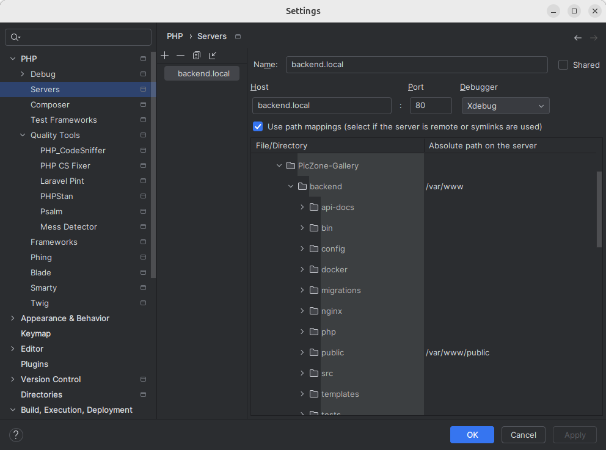

# Backend API Documentation

## 📄 Viewing API Documentation

⚠️ **API Documentation Update In Progress**: The API documentation is currently outdated due to the recent architecture refactor to **Hexagonal Architecture** and **CQRS**. The documentation will be updated soon to reflect these changes.

In the meantime, you can still view the existing documentation using Swagger UI with Docker, though it may not be fully accurate.

Run the following Docker command to start Swagger UI:

```bash
docker run -p 8082:8080 -e SWAGGER_JSON=/api-docs/openapi.yaml -v $(pwd)/api-docs:/api-docs swaggerapi/swagger-ui
```

## ✅ Running Tests

The project includes both **unit tests** and **integration tests**. These tests can be run through a script that manages the Docker environment for testing.

⚠️ **Note**: Integration tests for the **user module** are still being updated due to the project's transition to Hexagonal Architecture.

## ⚙️ Configuring the Test Environment

Before running tests, you need to configure the test environment. You have two options for setting up the test database.

### Option 1: Use the Same Database as in Development

1. **Copy and update environment file**:

   Copy the `backend/.env.example` file and rename it to `backend/.env.test`. Update the environment variables as needed, ensuring the database configuration matches the development database settings.

### Option 2: Create a Separate Database for the Test Environment

1. **Set up environment variables**:

   Copy the `backend/.env.example` file and rename it to `backend/.env.test`. Update the environment variables as needed.

2. **Modify the database volume**:

   In the `compose.test.yaml` file, update the volume for the test database. Replace the development volume with a test volume:

   ```yaml
   volumes:
     - postgres-data-test:/var/lib/postgresql/data
   
   # at the end of the compose.test.yaml:
   volumes:
       postgres-data-test:

3. **Run migrations**:

   Go into the `backend_test` container and run the migrations:

   ```bash
   docker exec -it backend_test bash
   php bin/console doctrine:migrations:migrate

## 💻 Test Commands

The script supports the following commands:

- **Start the test environment**: Sets up and starts all necessary services for testing without executing the tests automatically.

  ```bash
  ./start_test_compose.sh
  
### 🔧 Script Command Arguments

- `start`: Initializes and starts all necessary services for testing without running tests automatically.
- `stop`: Stops all services and cleans up the test environment.
- `test-unit`: Runs all unit tests and then shuts down the test environment.
- `test-integration`: Executes all integration tests and then stops all services.
- `test-all`: Runs both unit and integration tests, starting the environment beforehand and stopping it afterward.

## 🐞 Xdebug

To enable **Xdebug**, set the following environment variable in your `.env` file:

```env
XDEBUG_CLIENT_HOST=      # Set to 'host.docker.internal' for Windows/Mac or your host IP for Linux
```

Ensure you configure path mappings for your project. Below is an example using PHPStorm, where the local directory maps to `/var/www` in the container:



### 💻 For Xdebug to work with tests, add these two environment variables:

```env
XDEBUG_CONFIG=    # Set to idekey=PHPSTORM if using phpstorm
PHP_IDE_CONFIG=serverName=Hostname    # Replace 'Hostname' with the server name you use in PHP>Servers (backend.local in the example above).
```
